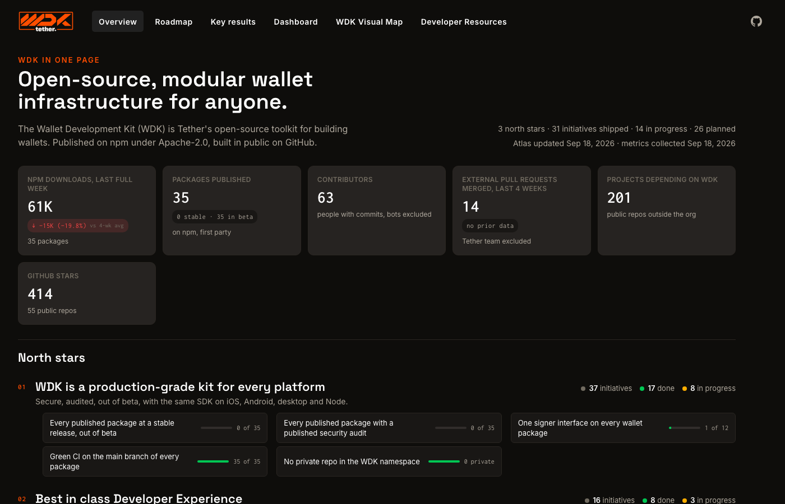
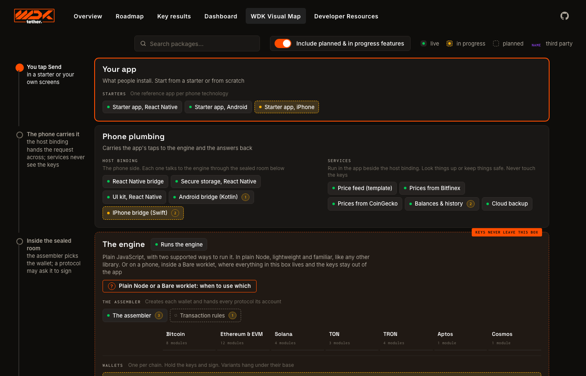
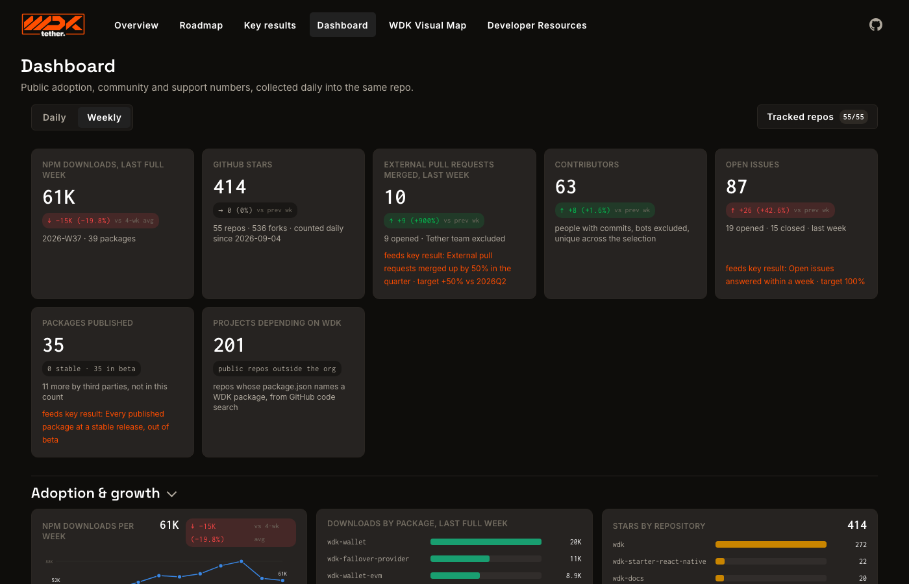

# WDK Atlas

One page that shows where Tether's Wallet Development Kit stands: what it is, what ships, what is
next, and the numbers behind it. Live at **https://g9ncue.github.io/wdk-atlas/**.



## Why

WDK is 35 packages across 55 public repos, built by several teams. Nobody can hold that in their
head, so questions like "is the iPhone starter out?", "how many people use this?" or "what does
production-grade mean here?" get answered from memory and from memory alone.

The atlas answers them from one place, with one rule: **every number can be recomputed by a stranger
from public sources.** npm, GitHub and one YAML file. Nothing is typed by hand, and a goal that cannot
be measured that way is not a key result here.

## What is inside

- **Overview**: the pitch, the three north stars, where each one stands, this quarter, risks.
- **Roadmap**: every initiative, grouped by north star, with its status and the modules it touches.
- **Key results**: the measures behind each north star and the facts they are read from.
- **Dashboard**: adoption, community and support numbers, collected daily.
- **WDK Visual Map**: the packages as a stack, from the app down to the chains, with the keys' boundary drawn.
- **Developer Resources**: where to start, by platform.



## How it stays honest

Two GitHub Actions jobs keep the site in line with reality.

**Metrics**, daily. Reads npm downloads, stars, forks, contributors, pull requests, issues and
response times for every public WDK repo, and commits the result to the repo. Every key result reads
from this file or from the map; the "Release readiness" section of the Dashboard shows the per-package
facts behind each one.



**Atlas drift**, weekly. Compares the map with GitHub and npm: dead or archived repos, a module whose
status disagrees with its npm release, dependencies that do not match, org repos the map forgot.
Findings land in one rolling issue labelled `atlas-drift`; fix the YAML and the next run clears the line.

## Run it locally

Static site, no build step. Serve the folder and open http://localhost:4173:

```
python3 -m http.server 4173
```

Both jobs are plain Node 22 scripts. Your own GitHub token raises the rate limit; the drift check
sees private repos only if that token can.

```
GITHUB_TOKEN=$(gh auth token) node bin/check-atlas.mjs
GITHUB_TOKEN=$(gh auth token) node bin/collect-metrics.mjs --dry
```

`--npm-only` refreshes just the figures that come from the npm registry, reusing the repository
list already in `data/metrics.json` and asking GitHub for nothing, so it needs no token:

```
node bin/collect-metrics.mjs --npm-only
```

## Editing the map

`atlas.yaml` is the source of truth: modules, sections, relations, mission, north stars, key results
and roadmap items. Its header comment documents every field. After changing it, `app.js`, `site.js`,
anything under `src/` or `lib/`, `styles.css` or `page.css`, bump the `?v=N` suffixes in `index.html` and `examples/embed.html`; a
gate fails if you forget.

The image a shared link shows is `assets/og.png`, drawn from `og-source.html` with the site's own
stylesheet so it cannot drift from the design. To redraw it after editing that file, serve the repo
and screenshot the page at its own size:

```
chrome --headless=new --window-size=1200,630 --screenshot=assets/og.png http://localhost:4173/og-source.html
```

## Embed it in another site

Atlas is one stylesheet and one entry module, `app.js`, which fetches what it needs from `src/`
and `lib/` beside it: serve the folder as it is. Every rule in `styles.css` is nested inside a single
`.wdk-atlas` root and the design tokens are declared on that root, so nothing of Atlas's reaches
the host page and nothing of the host's reaches Atlas. It claims no ids, puts nothing on `body`,
and leaves the address bar, the title and the host's keyboard alone.

**One tag.** Atlas renders where the tag sits, or inside an element marked `data-wdk-atlas`.
`data-page` on that element picks the page; links between pages are followed inside the frame.

```html
<link rel="stylesheet" href="https://example.com/atlas/styles.css" />
<div data-wdk-atlas data-page="map"></div>
<script type="module" src="https://example.com/atlas/app.js"></script>
```

**Or call it.** From a framework component, or anywhere a page wants to decide for itself:

```js
import { mount } from "https://example.com/atlas/app.js";

const atlas = mount(element, { page: "roadmap" });
atlas.setPage("dashboard");
atlas.destroy(); // removes the frame and every listener
```

| Option | Default | |
|---|---|---|
| `page` | `"overview"` | `overview`, `roadmap`, `results`, `dashboard`, `map` or `dev` |
| `base` | beside `app.js` | where `atlas.yaml`, `data/` and `vendor/` live |
| `syncUrl` | `false` | read the page, filters and open module from the address, and write them back |
| `setTitle` | `false` | set `document.title` and the meta description per page |
| `sourceUrl` | none | a link for the footer's "source" |

A page can hold several. Sticky headers stop at `--wdk-atlas-sticky-top` (default `0px`); set it
on `.wdk-atlas` to the height of a fixed bar of your own. This site is itself a consumer:
`index.html` is a top bar and an empty `<main>`, `site.js` calls `mount()` with `syncUrl` and
`setTitle`, and `page.css` styles the bar. None of the three is needed by a host.

`examples/embed.html` is the one-tag form. `examples/mount.html` mounts two instances in a
light-themed page that has a `.nav`, a `.search` and an `--accent` of its own.

## Security

The site is static and loads nothing from third parties. The automation behind it runs with the
least access it can and collects public data only: GitHub handles, which anyone can read off the
commits in these repositories, and no personal names. Please report anything you find to the
maintainer rather than in an issue.
